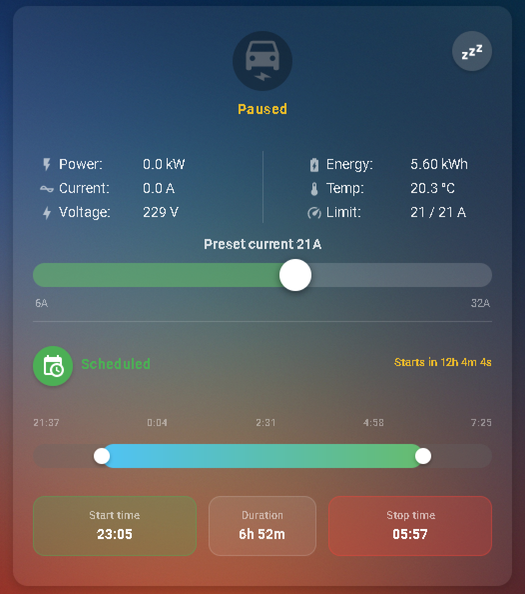
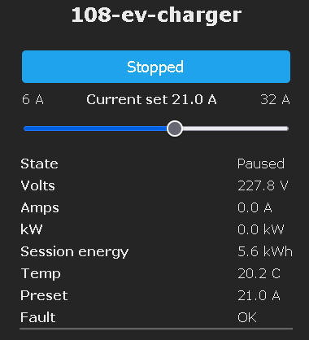
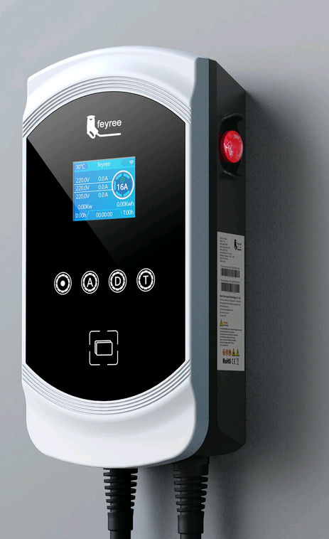

# Feyree EV Charger - Tasmota & Home Assistant Integration

### Home Assistant Dashboard, Tasmota Web Interface, Feyree charger

<p align="left">
  

  

  
</p>


## ⚠️ This is work in progress

A complete guide to integrating the Feyree 1P EV charger with Tasmota firmware on ESP8266 module and Home Assistant for smart charging control and monitoring.

---

## ⚠️ ⚠️ ⚠️ CRITICAL SAFETY WARNING ⚠️ ⚠️ ⚠️

```
╔═══════════════════════════════════════════════════════════════════════╗
║                                                                       ║
║   🔴 DANGER - HIGH VOLTAGE - RISK OF DEATH OR SERIOUS INJURY 🔴        ║
║                                                                       ║
║   NEVER OPEN THE CHARGER OR WORK ON INTERNAL COMPONENTS               ║
║   WHILE CONNECTED TO MAINS POWER (230V/110V)                          ║
║                                                                       ║
║   ⚡ ALWAYS DISCONNECT FROM MAINS BEFORE OPENING                      ║
║   ⚡ VERIFY POWER IS OFF WITH A VOLTAGE TESTER                        ║
║   ⚡ WAIT FOR CAPACITORS TO DISCHARGE (5+ MINUTES)                    ║
║   ⚡ ONLY QUALIFIED ELECTRICIANS SHOULD MODIFY THIS EQUIPMENT         ║
║                                                                       ║
║   Failure to follow these precautions can result in:                  ║
║   - Electric shock leading to death                                   ║
║   - Severe burns                                                      ║
║   - Fire hazard                                                       ║
║   - Property damage                                                   ║
║   - Voiding of all warranties and insurance                           ║
║                                                                       ║
╚═══════════════════════════════════════════════════════════════════════╝
```

**By proceeding with this modification, you acknowledge that:**
- You understand the risks of working with high-voltage equipment
- You are qualified to perform electrical work in your jurisdiction
- You accept full responsibility for any damage, injury, or death
- The authors of this guide assume NO LIABILITY whatsoever

---

## 📋 Table of Contents

- [Overview](#overview)
- [Features](#features)
- [Screenshots](#screenshots)
- [Hardware Requirements](#hardware-requirements)
- [Software Requirements](#software-requirements)
- [Installation](#installation)
  - [1. Flash Tasmota to ESP8266 Module](#1-flash-tasmota-to-ESP8266-module)
  - [2. Configure Tasmota](#2-configure-tasmota)
  - [3. Install Tasmota Script](#3-install-tasmota-script)
  - [4. Configure Home Assistant](#4-configure-home-assistant)
  - [5. Setup Automations](#5-setup-automations)
- [Usage](#usage)
- [MQTT Topics](#mqtt-topics)
- [Troubleshooting](#troubleshooting)
- [Contributing](#contributing)

## 🎯 Overview

This project enables full local control of the Feyree EV charger by replacing the cloud-dependent Tuya firmware with Tasmota on the ESP8266 module. It provides real-time monitoring, current adjustment (6-32A), and scheduled charging through Home Assistant.

**📚 Prerequisites (Required Before Starting):**
- ✅ Completed WBR3 module replacement with an ESP8266 module following the [Elektroda.com guide](https://www.elektroda.com/rtvforum/topic4085036.html)
- ✅ Knowledge of ESP8266 flashing procedures
- ✅ Working MQTT broker integrated with Home Assistant
- ✅ Basic Home Assistant YAML configuration skills
- ✅ Understanding of high-voltage electrical safety procedures
- ✅ Qualified to work with electrical equipment in your jurisdiction

**⚡ Safety First:** All configuration and flashing work is done with the charger **COMPLETELY DISCONNECTED** from mains power. See the safety warnings above before proceeding.

## ✨ Features

- **Real-time Monitoring**: Voltage, current, power, energy, and temperature
- **Current Control**: Adjust charging current from 6A to 32A
- **Charging States**: Free, Plugged in, Charging, Paused, Charged, Fault
- **Fault Detection**: Undervoltage, overvoltage, overcurrent, PE fault, temperature, CP signal, leakage, emergency stop
- **Scheduled Charging**: Start/stop charging at specific times
- **Keep-Alive Automation**: Prevents charger timeout during long charging sessions
- **Home Assistant Integration**: Full control through HA dashboard
- **MQTT Communication**: Local network control, no cloud dependency

## 🔧 Hardware Requirements

- **Feyree EV Charger with replaced WBR3 module** (Tuya-based) with **ESP8266 module preflashed with Tasmota**

> **⚠️ PREREQUISITE**: This guide assumes you have already replaced the stock WBR3 module with an ESP8266 module following the detailed guide on the [Elektroda.com forum](https://www.elektroda.com/rtvforum/topic4085036.html). If you haven't done this yet, **STOP HERE** and complete the module replacement first. The Elektroda guide provides essential safety information and step-by-step instructions for opening the charger and accessing the WBR3 module.

> **🔴 REMINDER**: ALL work on the module must be done with the charger **COMPLETELY DISCONNECTED** from mains power. Verify disconnection with a voltage tester.

## 💻 Software Requirements

- **Tasmota v14.x** with scripting support from the [Tasmota Specials Repository](https://github.com/tasmota/install)
  - ⚠️ Standard Tasmota builds does not include full scripting support
  - Download the **tasmota-scripting.bin** variant
- **Home Assistant** (any recent version with MQTT support)
- **MQTT Broker** (Mosquitto or similar) - must be already configured and running
- **ESP8266 Flashing Knowledge** - ability to flash ESP modules via serial connection

**Assumed Prerequisites:**
- You know how to flash ESP8266 modules (many tutorials available online)
- You have a working MQTT broker integrated with Home Assistant
- You understand basic Home Assistant configuration (YAML editing)
- You've completed the [Elektroda.com WBR3 replacement guide](https://www.elektroda.com/rtvforum/topic4085036.html)

## 🚀 Installation

### 1. Flash Tasmota to WBR3 Module


**Flash Tasmota v14.x with scripting support** to the ESP8266 module using your preferred method:
- Use **tasmota-scripting.bin** or **tasmota32-scripting.bin** from the Tasmota specials repository
- Standard ESP8266 flashing procedures apply (GPIO0 to GND for flash mode, 9600 or 115200 baud)
- Many tutorials are available online for ESP8266/WBR3 flashing if needed

**After Flashing:**
1. Disconnect USB-to-Serial adapter
2. **VERIFY** mains power is still disconnected
3. Reassemble the charger (if module was removed)
4. **ONLY THEN** reconnect to mains power
5. The ESP8266 will boot into Tasmota and create a WiFi access point

### 2. Configure Tasmota

> **⚡ SAFETY CHECKPOINT BEFORE POWER-UP:**
> 1. Ensure the charger enclosure is **FULLY REASSEMBLED**
> 2. Verify all **connections are secure** and no tools/wires are left inside
> 3. **ONLY NOW** reconnect to mains power to configure Tasmota
> 4. If you need to access the WBR3 module again, **DISCONNECT MAINS FIRST**

1. Connect to the Tasmota WiFi AP (e.g., `tasmota-XXXXXX`)
2. Configure your WiFi credentials
3. Access the Tasmota web interface (check your router for the IP)
4. Navigate to **Configuration** → **Configure Other**
5. Paste and check **Template**:
   ```json
   {"NAME":"Feyree Charger","GPIO":[0,0,0,0,0,0,0,0,0,0,0,0,0,0],"FLAG":0,"BASE":54}
   ```
6. Save and reboot

### 3. Install Tasmota Script

1. In Tasmota console disable opttion 114:
   ```
   SetOption114 0
   ```
   *(This hides the power button as it's not used)*

2. Navigate to **Tools** → **Edit Script**

3. Paste the complete script:

```Tasmota Script
>D
p:cs=0
p:vr=0
p:ar=0
p:wr=0
p:tr=0
p:pa=0
p:er=0
p:fc=0
ft=""
st=""
d=""
p:mc=16
p:cc=1
>B
baudrate 9600
TuyaMCU 0,4
TuyaSend0
>E
if TuyaReceived#DpType2Id125>=0
then
pa=TuyaReceived#DpType2Id125
mc=pa
endif
if TuyaReceived#DpType4Id101>=0
then
cs=TuyaReceived#DpType4Id101
endif
if TuyaReceived#DpType4Id124>=0
then
cc=TuyaReceived#DpType4Id124
endif
d=TuyaReceived#DpType5Id10
if d!=""
then
if d=="0x00"
then
fc=0
endif
if d=="0x1000"
then
fc=4096
endif
if d=="0x01"
then
fc=1
endif
if d=="0x02"
then
fc=2
endif
if d=="0x04"
then
fc=4
endif
if d=="0x08"
then
fc=8
endif
if d=="0x10"
then
fc=16
endif
if d=="0x20"
then
fc=32
endif
if d=="0x40"
then
fc=64
endif
if d=="0x80"
then
fc=128
endif
endif
if TuyaReceived#DpType2Id102>=0
then
vr=TuyaReceived#DpType2Id102
endif
if TuyaReceived#DpType2Id105>=0
then
ar=TuyaReceived#DpType2Id105
endif
if TuyaReceived#DpType2Id112>=0
then
er=TuyaReceived#DpType2Id112
endif
if TuyaReceived#DpType2Id109>=0
then
wr=TuyaReceived#DpType2Id109
endif
if TuyaReceived#DpType2Id110>=0
then
tr=TuyaReceived#DpType2Id110
endif
>S
if chg[mc]>0
then
=>TuyaSend2 115,%0mc%
svars
endif
if chg[cc]>0
then
=>TuyaSend4 124,%0cc%
svars
endif
switch cs
case 0
st="Free"
case 1
st="Plugged in"
case 2
st="Charging"
case 3
st="???"
case 4
st="Paused"
case 5
st="Charged"
case 6
st="Fault"
ends
switch fc
case 0
ft="OK"
case 1
ft="Undervolt"
case 2
ft="Overvolt"
case 4
ft="Overcurrent"
case 8
ft="PE"
case 16
ft="Temp"
case 32
ft="CP"
case 64
ft="Leakage"
case 128
ft="Reserved"
case 4096
ft="EMERGENCY"
ends
if chg[cs]>0
or chg[vr]>0
or chg[ar]>0
or chg[wr]>0
or chg[tr]>0
or chg[pa]>0
or chg[er]>0
or chg[fc]>0
then
=>Publish stat/108/data {"state":"%st%","voltage":%1(vr/10)%,"current":%1(ar/10)%,"power":%3(wr/10)%,"energy":%3(er/10)%,"temp":%1(tr/10)%,"preset":%0pa%,"fault":"%ft%"}
>W
{s}State{m}%st%{e}
{s}Volts{m}%1(vr/10)% V{e}
{s}Amps{m}%1(ar/10)% A{e}
{s}kW{m}%1(wr/10)% kW{e}
{s}Session energy{m}%1(er/10)% kWh{e}
{s}Temp{m}%1(tr/10)% C{e}
{s}Preset{m}%0pa%.0 A{e}
{s}Fault{m}%ft%{e}
bu(cc "Stopped" "Charging")
sl(6 32 mc "6 A" "Current set %0mc%.0 A" "32 A")
```

4. Click **Save** and reboot

#### Script Explanation

| Section | Description |
|---------|-------------|
| `>D` | Variable declarations (current, voltage, power, temp, etc.) |
| `>B` | Boot section - sets baudrate and initializes Tuya MCU |
| `>E` | Event section - processes Tuya datapoints and fault codes |
| `>S` | Sensor section - publishes MQTT data and updates web interface |
| `>W` | Web interface - displays current values and provides controls |

#### Tuya Datapoint Mapping

| DP ID | Type | Description | Range |
|-------|------|-------------|-------|
| 101 | Enum | Charging state | 0-6 |
| 102 | Integer | Voltage | 0-2500 (×0.1V) |
| 105 | Integer | Current | 0-320 (×0.1A) |
| 109 | Integer | Power | 0-7000 (×0.1kW) |
| 110 | Integer | Temperature | 0-100 (×0.1°C) |
| 112 | Integer | Session Energy | 0-100000 (×0.1kWh) |
| 115 | Integer | Current Preset | 6-32 (A) |
| 124 | Boolean | Charge Enable | 0=On, 1=Off |
| 125 | Integer | Current Max | 6-32 (A) |
| 10 | Raw | Fault Code | Hex value |

### 4. Configure Home Assistant

> **Assumption**: You already have a working MQTT broker configured and integrated with Home Assistant.

#### Add Light Entity (for Charging Control)

Add to `configuration.yaml`:

```yaml
light:
  - platform: template
    lights:
      108_ev_charger:
        friendly_name: "EV Charger"
        unique_id: "108_ev_charger"
        value_template: >-
          {{ is_state('sensor.108_ev_charger_state', 'Charging') }}
        level_template: >-
          
          {{ ((current - 6) * 255 / 26) | round(0) | int }}
        turn_on:
          - service: mqtt.publish
            data:
              topic: "cmnd/108/TuyaSend4"
              payload: "124,0"
        turn_off:
          - service: mqtt.publish
            data:
              topic: "cmnd/108/TuyaSend4"
              payload: "124,1"
        set_level:
          - service: mqtt.publish
            data:
              topic: "cmnd/108/TuyaSend2"
              payload: >-
                115,{{ ((brightness / 255 * 26) + 6) | round(0) | int }}
```

> **Note**: The charger is exposed as a `light` entity to leverage HA's brightness slider for current control (6-32A).

#### Add MQTT Sensors

Add to `configuration.yaml`:

```yaml
mqtt:
  sensor:
    - name: Sparky
      state_topic: mt/status/endpoint/sparky
      value_template: "{{ value_json.status }}"
      
    - name: "108 EV Charger State"
      unique_id: "108_ev_charger_state"
      state_topic: "stat/108/data"
      value_template: "{{ value_json.state }}"
      
    - name: "108 EV Charger Energy Voltage"
      unique_id: "108_ev_charger_energy_voltage"
      state_topic: "stat/108/data"
      value_template: "{{ value_json.voltage }}"
      unit_of_measurement: "V"
      device_class: voltage
      state_class: measurement
      
    - name: "108 EV Charger Energy Current"
      unique_id: "108_ev_charger_energy_current"
      state_topic: "stat/108/data"
      value_template: "{{ (value_json.current) | round(0) }}"
      unit_of_measurement: "A"
      device_class: current
      state_class: measurement
      
    - name: "108 EV Charger Energy Power"
      unique_id: "108_ev_charger_energy_power"
      state_topic: "stat/108/data"
      value_template: "{{ value_json.power }}"
      unit_of_measurement: "kW"
      device_class: power
      state_class: measurement
      
    - name: "108 EV Charger Session Energy"
      unique_id: "108_ev_charger_session_energy"
      state_topic: "stat/108/data"
      value_template: "{{ value_json.energy }}"
      unit_of_measurement: "kWh"
      device_class: energy
      state_class: total_increasing
      
    - name: "108 EV Charger Temperature"
      unique_id: "108_ev_charger_temperature"
      state_topic: "stat/108/data"
      value_template: "{{ value_json.temp }}"
      unit_of_measurement: "°C"
      device_class: temperature
      state_class: measurement
      
    - name: "108 EV Charger Preset Current"
      unique_id: "108_ev_charger_preset_current"
      state_topic: "stat/108/data"
      value_template: "{{ value_json.preset }}"
      unit_of_measurement: "A"
      
    - name: "108 EV Charger Fault"
      unique_id: "108_ev_charger_fault"
      state_topic: "stat/108/data"
      value_template: "{{ value_json.fault }}"

```

#### Add Template Sensor (Helper)

Add to `configuration.yaml`:

```yaml
template:
  - sensor:
      - name: "Server Time Seconds"
        unique_id: server_time_sec_001
        state: "{{ now().strftime('%H:%M:%S') }}"
```

#### Add Input Helpers

Add to `configuration.yaml`:

```yaml
input_boolean:
  ev_charging_schedule_enabled:
    name: EV Charging Schedule
    icon: mdi:calendar-clock
  ev_charger_keep_alive:
    name: EV Charger Keep Alive
    icon: mdi:calendar-clock

input_datetime:
  ev_charge_start:
    name: Charge Start Time
    has_date: false
    has_time: true
    
  ev_charge_stop:
    name: Charge Stop Time
    has_date: false
    has_time: true
```

### 5. Setup Automations

Add to `automations.yaml`:

```yaml

- id: '1769440190340'
  alias: EV Scheduled Charging
  description: Automatically start/stop charging based on schedule
  triggers:
  - at: input_datetime.ev_charge_start
    id: start_charging
    trigger: time
  - at: input_datetime.ev_charge_stop
    id: stop_charging
    trigger: time
  conditions:
  - condition: state
    entity_id: input_boolean.ev_charging_schedule_enabled
    state: 'on'
  actions:
  - choose:
    - conditions:
      - condition: trigger
        id: start_charging
      sequence:
      - target:
          entity_id: light.108_ev_charger
        action: light.turn_on
    - conditions:
      - condition: trigger
        id: stop_charging
      sequence:
      - target:
          entity_id: light.108_ev_charger
        action: light.turn_off
  mode: single
- id: '1769443165773'
  alias: Update Time Every Second
  description: ''
  triggers:
  - seconds: /1
    trigger: time_pattern
  actions:
  - target:
      entity_id: sensor.server_time_seconds
    action: homeassistant.update_entity
    data:
      entity_id:
      - sensor.server_time_seconds
- id: ev_keep_alive_pulse_001
  alias: EV Charger Keep Alive
  triggers:
  - hours: '*'
    minutes: '55'
    trigger: time_pattern
  conditions:
  - condition: state
    entity_id: input_boolean.ev_charger_keep_alive
    state: 'on'
  - condition: numeric_state
    entity_id: sensor.108_ev_charger_energy_current
    below: 0.2
  actions:
  - variables:
      stored_preset: '{{ states(''sensor.108_ev_charger_preset_current'') | int(16)
        }}'
      was_charging: '{{ is_state(''light.108_ev_charger'', ''on'') }}'
  - data:
      name: EV Charger Keep Alive
      message: 'Starting pulse. Was charging: {{ was_charging }}, Original Preset:
        {{ stored_preset }}A

        '
    action: logbook.log
  - data:
      topic: cmnd/108/TuyaSend2
      payload: 115,6
    action: mqtt.publish
  - delay:
      hours: 0
      minutes: 0
      seconds: 1
      milliseconds: 500
  - data:
      topic: cmnd/108/TuyaSend4
      payload: 124,0
    action: mqtt.publish
  - delay:
      hours: 0
      minutes: 0
      seconds: 20
      milliseconds: 0
  - data:
      topic: cmnd/108/TuyaSend4
      payload: 124,1
    action: mqtt.publish
  - delay:
      seconds: 2
  - data:
      topic: cmnd/108/TuyaSend2
      payload: 115,{{ stored_preset }}
    action: mqtt.publish
  - data:
      name: EV Charger Keep Alive
      message: Pulse complete. Preset restored to {{ stored_preset }}A
    action: logbook.log
  mode: single

```

#### Automation Descriptions

| Automation | Purpose |
|------------|---------|
| **EV Scheduled Charging** | Starts/stops charging at configured times when schedule is enabled |
| **Update Time Every Second** | Updates the time sensor used by the dashboard |
| **EV Charger Keep Alive** | Prevents charger timeout during long sessions by sending periodic pulses |


### HA Dashboard 

```yaml
type: grid
columns: 1
cards:
  - type: custom:button-card
    entity: light.108_ev_charger
    show_icon: false
    show_name: false
    show_state: false
    tap_action:
      action: none
    hold_action:
      action: none
    double_tap_action:
      action: none
    triggers_update:
      - light.108_ev_charger
      - sensor.server_time_seconds
      - sensor.108_ev_charger_energy_current
      - sensor.108_ev_charger_energy_voltage
      - sensor.108_ev_charger_energy_power
      - sensor.108_ev_charger_energy_total
      - sensor.108_ev_charger_temperature
      - sensor.108_ev_charger_state
      - sensor.108_ev_charger_fault
      - sensor.108_ev_charger_preset_current
      - input_boolean.ev_charging_schedule_enabled
      - input_boolean.ev_charger_keep_alive
      - input_datetime.ev_charge_start
      - input_datetime.ev_charge_stop
    styles:
      card:
        - height: 580px
        - border-radius: 15px
        - border: none
        - overflow: visible
        - background: rgba(255,255,255,0.08)
        - box-shadow: 0 4px 12px rgba(0,0,0,0.2)
        - position: relative
      custom_fields:
        icon:
          - pointer-events: auto
        keep_alive_indicator:
          - pointer-events: auto
        schedule_icon:
          - pointer-events: auto
        slider:
          - pointer-events: auto
        schedule_buttons:
          - pointer-events: auto
    custom_fields:
      background_bar: |
        [[[
          const power = parseFloat(states['sensor.108_ev_charger_energy_power']?.state || 0);
          const max = 7500;
          const pct = Math.min((power / max) * 100, 100);
          let color = 'rgba(100,100,100,0.3)';
          if (power > 100) color = 'linear-gradient(to right, rgba(100,100,100,0.5), rgba(100,200,100,0.5))';
          if (power > 2000) color = 'linear-gradient(to right, #4fc3f7, #66bb6a)';
          if (power > 4000) color = 'linear-gradient(to right, #66bb6a, #ffb74d)';
          if (power > 6000) color = 'linear-gradient(to right, #ffb74d, #ef5350)';
          return `<div style="position:absolute;left:0;top:0;height:260px;width:${pct}%;background:${color};border-radius:15px 15px 0 0;transition:width 0.5s ease;pointer-events:none;"></div>`;
        ]]]
      icon: |
        [[[
          const state = states['sensor.108_ev_charger_state']?.state || 'Unknown';
          const current = parseFloat(states['sensor.108_ev_charger_energy_current']?.state || 0);
          let color = 'rgba(150,150,150,0.5)';
          let icon = 'mdi:car-electric';

          if (state === 'Charging' || state === 'Plugged in') {
            if (current > 1) {
              color = 'lime';
              icon = 'mdi:ev-station';
            } else {
              color = 'rgb(200,200,100)';
            }
          } else if (state === 'Charged') {
            color = 'rgb(76,175,80)';
            icon = 'mdi:battery-charging-100';
          } else if (state === 'Fault') {
            color = 'rgb(244,67,54)';
            icon = 'mdi:alert-circle';
          }

          const animation = (current > 1 && state === 'Charging') ? 'pulse 2s ease-in-out infinite' : 'none';

          return `
            <div onclick="event.stopPropagation();
                         const hass = this.getRootNode().host._hass;
                         hass.callService('light', 'toggle', {entity_id: '${entity.entity_id}'});"
                 style="position:absolute;left:50%;top:25px;transform:translateX(-50%);width:60px;height:60px;cursor:pointer;display:flex;align-items:center;justify-content:center;border-radius:50%;background:rgba(0,0,0,0.3);">
              <ha-icon icon="${icon}" style="width:44px;height:44px;color:${color};animation:${animation};"></ha-icon>
            </div>
          `;
        ]]]
      charge_status: |
        [[[
          const state = states['sensor.108_ev_charger_state']?.state || 'Unknown';
          const fault = states['sensor.108_ev_charger_fault']?.state || 'OK';
          let statusColor = 'rgba(150,150,150,0.7)';
          
          if (state === 'Charging') statusColor = 'rgb(76,175,80)';
          else if (state === 'Charged') statusColor = 'rgb(100,200,100)';
          else if (state === 'Plugged in') statusColor = 'rgb(200,200,100)';
          else if (state === 'Paused') statusColor = 'rgba(255,200,0,0.9)';
          else if (state === 'Fault') statusColor = 'rgb(244,67,54)';
          
          const faultWarning = fault !== 'OK' ? `<div style="font-size:11px;color:rgb(255,152,0);margin-top:4px;">⚠ ${fault}</div>` : '';
          
          return `
            <div style="position:absolute;left:50%;top:95px;transform:translateX(-50%);text-align:center;pointer-events:none;">
              <div style="font-size:14px;font-weight:600;color:${statusColor};letter-spacing:0.5px;">${state}</div>
              ${faultWarning}
            </div>
          `;
        ]]]
      info_grid: |
        [[[
          const current = parseFloat(states['sensor.108_ev_charger_energy_current']?.state || 0);
          const voltage = parseFloat(states['sensor.108_ev_charger_energy_voltage']?.state || 0);
          const temp = parseFloat(states['sensor.108_ev_charger_temperature']?.state || 0);
          const power = parseFloat(states['sensor.108_ev_charger_energy_power']?.state || 0);
          const powerKw = power.toFixed(1);
          const energy = parseFloat(states['sensor.108_ev_charger_session_energy']?.state || 0);

          // "Requested" value (from light brightness) - fallback
          const lightState = states['light.108_ev_cahrger'];
          const brightness = lightState?.attributes?.brightness ?? 0;
          const ampsFromBrightness = Math.round((((brightness - 1) / 254) * 26) + 6);

          // "Reported by charger"
          const presetEntity = states['sensor.108_ev_charger_preset_current'];
          const presetRaw = presetEntity?.state;
          const presetReported = parseInt(presetRaw, 10);
          const presetValid = Number.isFinite(presetReported) && presetReported >= 6 && presetReported <= 32;

          // Slider follows reported value when valid; otherwise fallback to brightness-derived
          const sliderAmps = presetValid ? presetReported : ampsFromBrightness;
          const presetReportedTxt = Number.isFinite(presetReported) ? String(presetReported) : '—';

          const textColor = 'rgba(255,255,255,0.9)';
          const iconColor = 'rgba(255,255,255,0.6)';

          const iconColWidth = '20px';
          const labelColWidth = '80px';
          const valueColWidth = '80px';
          const rowHeight = '24px';

          return `
            <div style="position:absolute;left:20px;right:20px;top:145px;display:flex;justify-content:space-between;pointer-events:none;">
              <div style="display:table;border-spacing:0;padding-right:6px;">
                <div style="display:table-row;height:${rowHeight};">
                  <div style="display:table-cell;width:${iconColWidth};text-align:right;padding:2px;vertical-align:middle;">
                    <ha-icon icon="mdi:flash" style="width:16px;height:16px;color:${iconColor};"></ha-icon>
                  </div>
                  <div style="display:table-cell;width:${labelColWidth};text-align:left;padding:2px;vertical-align:middle;">
                    <span style="font-size:14px;color:${textColor};">Power:</span>
                  </div>
                  <div style="display:table-cell;width:${valueColWidth};text-align:left;padding:2px;vertical-align:middle;">
                    <span style="font-size:14px;color:${textColor};">${powerKw} kW</span>
                  </div>
                </div>

                <div style="display:table-row;height:${rowHeight};">
                  <div style="display:table-cell;width:${iconColWidth};text-align:right;padding:2px;vertical-align:middle;">
                    <ha-icon icon="mdi:current-ac" style="width:16px;height:16px;color:${iconColor};"></ha-icon>
                  </div>
                  <div style="display:table-cell;width:${labelColWidth};text-align:left;padding:2px;vertical-align:middle;">
                    <span style="font-size:14px;color:${textColor};">Current:</span>
                  </div>
                  <div style="display:table-cell;width:${valueColWidth};text-align:left;padding:2px;vertical-align:middle;">
                    <span style="font-size:14px;color:${textColor};">${current.toFixed(1)} A</span>
                  </div>
                </div>

                <div style="display:table-row;height:${rowHeight};">
                  <div style="display:table-cell;width:${iconColWidth};text-align:right;padding:2px;vertical-align:middle;">
                    <ha-icon icon="mdi:lightning-bolt" style="width:16px;height:16px;color:${iconColor};"></ha-icon>
                  </div>
                  <div style="display:table-cell;width:${labelColWidth};text-align:left;padding:2px;vertical-align:middle;">
                    <span style="font-size:14px;color:${textColor};">Voltage:</span>
                  </div>
                  <div style="display:table-cell;width:${valueColWidth};text-align:left;padding:2px;vertical-align:middle;">
                    <span style="font-size:14px;color:${textColor};">${voltage.toFixed(0)} V</span>
                  </div>
                </div>
              </div>

              <div style="width:1px;background:rgba(255,255,255,0.15);margin:0 6px;"></div>

              <div style="display:table;border-spacing:0;padding-left:6px;">
                <div style="display:table-row;height:${rowHeight};">
                  <div style="display:table-cell;width:${iconColWidth};text-align:right;padding:2px;vertical-align:middle;">
                    <ha-icon icon="mdi:battery-charging" style="width:16px;height:16px;color:${iconColor};"></ha-icon>
                  </div>
                  <div style="display:table-cell;width:${labelColWidth};text-align:left;padding:2px;vertical-align:middle;">
                    <span style="font-size:14px;color:${textColor};">Energy:</span>
                  </div>
                  <div style="display:table-cell;width:${valueColWidth};text-align:left;padding:2px;vertical-align:middle;">
                    <span style="font-size:14px;color:${textColor};">${energy.toFixed(2)} kWh</span>
                  </div>
                </div>

                <div style="display:table-row;height:${rowHeight};">
                  <div style="display:table-cell;width:${iconColWidth};text-align:right;padding:2px;vertical-align:middle;">
                    <ha-icon icon="mdi:thermometer" style="width:16px;height:16px;color:${iconColor};"></ha-icon>
                  </div>
                  <div style="display:table-cell;width:${labelColWidth};text-align:left;padding:2px;vertical-align:middle;">
                    <span style="font-size:14px;color:${textColor};">Temp:</span>
                  </div>
                  <div style="display:table-cell;width:${valueColWidth};text-align:left;padding:2px;vertical-align:middle;">
                    <span style="font-size:14px;color:${textColor};">${temp.toFixed(1)} °C</span>
                  </div>
                </div>

                <div style="display:table-row;height:${rowHeight};">
                  <div style="display:table-cell;width:${iconColWidth};text-align:right;padding:2px;vertical-align:middle;">
                    <ha-icon icon="mdi:speedometer" style="width:16px;height:16px;color:${iconColor};"></ha-icon>
                  </div>
                  <div style="display:table-cell;width:${labelColWidth};text-align:left;padding:2px;vertical-align:middle;">
                    <span style="font-size:14px;color:${textColor};">Limit:</span>
                  </div>
                  <div style="display:table-cell;width:${valueColWidth};text-align:left;padding:2px;vertical-align:middle;">
                    <span style="font-size:14px;color:${textColor};">
                      <span class="limit-setpoint">${sliderAmps}</span> / ${presetReportedTxt} A
                    </span>
                  </div>
                </div>
              </div>
            </div>
          `;
        ]]]
      keep_alive_indicator: |
        [[[
          const keepAlive = states['input_boolean.ev_charger_keep_alive'];
          if (!keepAlive) return '';
          const enabled = keepAlive.state === 'on';
          const color = enabled ? 'rgb(76,175,80)' : 'rgba(150,150,150,0.3)';
          const icon = enabled ? 'mdi:sleep-off' : 'mdi:sleep';
          return `
            <div onclick="event.stopPropagation();
                         const hass = this.getRootNode().host._hass;
                         hass.callService('input_boolean', 'toggle', {entity_id: 'input_boolean.ev_charger_keep_alive'});"
                 style="position:absolute;right:20px;top:25px;width:40px;height:40px;display:flex;align-items:center;justify-content:center;cursor:pointer;background:${color};border-radius:50%;box-shadow:0 2px 4px rgba(0,0,0,0.2);">
              <ha-icon icon="${icon}" style="width:22px;height:22px;color:white;"></ha-icon>
            </div>
          `;
        ]]]
      slider: |
        [[[
          // Fallback from light brightness
          const brightness = entity?.attributes?.brightness ?? 0;
          const ampsFromBrightness = Math.round((((brightness - 1) / 254) * 26) + 6);

          // Prefer charger-reported preset current when valid
          const presetRaw = states['sensor.108_ev_charger_preset_current']?.state;
          const presetReported = parseInt(presetRaw, 10);
          const presetValid = Number.isFinite(presetReported) && presetReported >= 6 && presetReported <= 32;

          const amperage = presetValid ? presetReported : ampsFromBrightness;

          const fillPercent = Math.min(98, ((amperage - 6) / (32 - 6)) * 100);

          return `
            <div style="position:absolute;top:230px;left:20px;right:20px;height:70px;display:flex;flex-direction:column;gap:8px;">
              <div style="text-align:center;font-size:14px;color:rgba(255,255,255,0.8);font-weight:600;pointer-events:none;">
                <span class="preset-display-text">Preset current ${amperage}A</span>
              </div>

              <div style="position:relative;height:40px;display:flex;align-items:center;">
                <div style="position:absolute;width:100%;height:24px;background:rgba(255,255,255,0.15);border-radius:12px;pointer-events:none;"></div>

                <div class="slider-fill-track"
                     style="position:absolute;width:${fillPercent}%;height:24px;background:rgba(76,175,80,0.5);border-radius:12px 0 0 12px;pointer-events:none;transition:width 0.1s ease;"></div>

                <input type="range"
                       class="charging-slider"
                       min="6"
                       max="32"
                       value="${amperage}"
                       step="1"
                       style="position:relative;
                              width:100%;
                              height:24px;
                              background:transparent;
                              border-radius:12px;
                              outline:none;
                              -webkit-appearance:none;
                              appearance:none;
                              cursor:pointer;
                              touch-action: pan-x;
                              z-index:10;"
                       oninput="
                         const value = parseInt(this.value, 10);
                         const fillPct = Math.min(98, ((value - 6) / (32 - 6)) * 100);

                         const root = this.getRootNode();
                         const textDisplay = root.querySelector('.preset-display-text');
                         const fillTrack = root.querySelector('.slider-fill-track');
                         const limitSet = root.querySelector('.limit-setpoint');

                         if (textDisplay) textDisplay.textContent = 'Preset current ' + value + 'A';
                         if (fillTrack) fillTrack.style.width = fillPct + '%';

                         // FIX #1: update Info -> Limit first value live while dragging
                         if (limitSet) limitSet.textContent = String(value);
                       "
                       onchange="
                         const hass = this.getRootNode().host._hass;
                         const amps = parseInt(this.value, 10);
                         if (amps >= 6 && amps <= 32) {
                            let newBrightness = Math.round(((amps - 6) / 26) * 254) + 1; // 6A->1, 32A->255
                            newBrightness = Math.max(1, Math.min(255, newBrightness));

                            hass.callService('light', 'turn_on', {
                              entity_id: '${entity.entity_id}',
                              brightness: newBrightness
                            });
                         }
                       "
                />
              </div>

              <div style="display:flex;justify-content:space-between;font-size:11px;color:rgba(255,255,255,0.5);padding:0 2px;pointer-events:none;">
                <span>6A</span>
                <span>32A</span>
              </div>

              <style>
                input[type=range].charging-slider::-webkit-slider-thumb {
                  -webkit-appearance: none;
                  appearance: none;
                  width: 32px;
                  height: 32px;
                  background: white;
                  border-radius: 50%;
                  cursor: pointer;
                  box-shadow: 0 2px 8px rgba(0,0,0,0.5);
                }
                input[type=range].charging-slider::-moz-range-thumb {
                  width: 32px;
                  height: 32px;
                  background: white;
                  border-radius: 50%;
                  cursor: pointer;
                  border: none;
                  box-shadow: 0 2px 8px rgba(0,0,0,0.5);
                }
                input[type=range].charging-slider::-webkit-slider-runnable-track {
                  background: transparent;
                  height: 24px;
                }
                input[type=range].charging-slider::-moz-range-track {
                  background: transparent;
                  height: 24px;
                }
              </style>
            </div>
          `;
        ]]]
      divider: |
        [[[
          return `<div style="position:absolute;top:315px;left:20px;right:20px;height:1px;background:rgba(255,255,255,0.15);pointer-events:none;"></div>`;
        ]]]
      schedule_icon: |
        [[[
          const enabled = states['input_boolean.ev_charging_schedule_enabled'].state === 'on';
          const color = enabled ? 'rgb(76,175,80)' : 'rgba(150,150,150,0.3)';
          return `
            <div onclick="event.stopPropagation();
                         const hass = this.getRootNode().host._hass;
                         hass.callService('input_boolean', 'toggle', {entity_id: 'input_boolean.ev_charging_schedule_enabled'});"
                 style="position:absolute;left:20px;top:340px;width:40px;height:40px;display:flex;align-items:center;justify-content:center;cursor:pointer;background:${color};border-radius:50%;box-shadow:0 2px 4px rgba(0,0,0,0.2);">
              <ha-icon icon="mdi:calendar-clock" style="width:24px;height:24px;color:white;"></ha-icon>
            </div>
          `;
        ]]]
      schedule_status: |
        [[[
          const enabled = states['input_boolean.ev_charging_schedule_enabled'].state === 'on';
          return `<div style="position:absolute;left:68px;top:350px;font-size:14px;font-weight:600;color:${enabled ? 'rgb(76,175,80)' : 'rgba(150,150,150,0.7)'};pointer-events:none;letter-spacing:0.3px;">${enabled ? 'Scheduled' : 'Manual'}</div>`;
        ]]]
      countdown: |
        [[[
          const startEntity = states['input_datetime.ev_charge_start'];
          const stopEntity = states['input_datetime.ev_charge_stop'];
          const scheduleEnabled = states['input_boolean.ev_charging_schedule_enabled'];
          const enabled = scheduleEnabled && scheduleEnabled.state === 'on';
          const serverTime = states['sensor.server_time_seconds'];

          if (!enabled || !startEntity || !stopEntity || !startEntity.state || !stopEntity.state || !serverTime) {
            return '';
          }

          const [currentH, currentM, currentS] = serverTime.state.split(':').map(Number);
          const [startH, startM, startS = 0] = startEntity.state.split(':').map(Number);
          const [stopH, stopM, stopS = 0] = stopEntity.state.split(':').map(Number);

          const currentTotalSeconds = currentH * 3600 + currentM * 60 + currentS;
          const startTotalSeconds = startH * 3600 + startM * 60 + startS;
          const stopTotalSeconds = stopH * 3600 + stopM * 60 + stopS;

          let timeToStartSeconds = startTotalSeconds - currentTotalSeconds;
          let timeToStopSeconds = stopTotalSeconds - currentTotalSeconds;

          if (timeToStartSeconds < 0) timeToStartSeconds += 86400;
          if (timeToStopSeconds < 0) timeToStopSeconds += 86400;

          let inWindow = false;
          if (stopTotalSeconds < startTotalSeconds) {
            inWindow = currentTotalSeconds >= startTotalSeconds || currentTotalSeconds < stopTotalSeconds;
          } else {
            inWindow = currentTotalSeconds >= startTotalSeconds && currentTotalSeconds < stopTotalSeconds;
          }

          const targetSeconds = inWindow ? timeToStopSeconds : timeToStartSeconds;
          const hours = Math.floor(targetSeconds / 3600);
          const mins = Math.floor((targetSeconds % 3600) / 60);
          const secs = targetSeconds % 60;

          let message = '';
          let color = 'rgba(255,200,0,0.9)';

          if (inWindow) {
            message = `Stops in ${hours}h ${mins}m ${secs}s`;
            color = 'rgb(76,175,80)';
          } else {
            message = `Starts in ${hours}h ${mins}m ${secs}s`;
          }

          return `<div style="position:absolute;right:20px;top:350px;font-size:11px;font-weight:600;color:${color};pointer-events:none;">${message}</div>`;
        ]]]
      timeline_markers: |
        [[[
          const startEntity = states['input_datetime.ev_charge_start'];
          const stopEntity = states['input_datetime.ev_charge_stop'];

          if (!startEntity || !stopEntity || !startEntity.state || !stopEntity.state) {
            return '';
          }

          const startTime = startEntity.state;
          const stopTime = stopEntity.state;

          const startHour = parseFloat(startTime.split(':')[0]) + parseFloat(startTime.split(':')[1]) / 60;
          const stopHour = parseFloat(stopTime.split(':')[0]) + parseFloat(stopTime.split(':')[1]) / 60;

          let chargeDuration = stopHour - startHour;
          if (chargeDuration < 0) chargeDuration += 24;

          const totalTimelineSpan = chargeDuration / 0.7;
          const padding = (totalTimelineSpan - chargeDuration) / 2;

          let timelineStart = startHour - padding;
          if (timelineStart < 0) timelineStart += 24;

          const markers = [];
          for (let i = 0; i < 5; i++) {
            let hour = timelineStart + (i * totalTimelineSpan / 4);
            if (hour >= 24) hour -= 24;
            const displayHour = Math.floor(hour);
            const displayMin = Math.round((hour - displayHour) * 60);

            if (totalTimelineSpan < 2) {
              markers.push(`${displayHour}:${displayMin.toString().padStart(2,'0')}`);
            } else {
              markers.push(displayMin === 0 ? `${displayHour}:00` : `${displayHour}:${displayMin.toString().padStart(2,'0')}`);
            }
          }

          return `
            <div style="position:absolute;top:410px;left:20px;right:20px;display:flex;justify-content:space-between;pointer-events:none;">
              ${markers.map(m => `<div style="font-size:10px;color:rgba(255,255,255,0.4);font-weight:500;">${m}</div>`).join('')}
            </div>
          `;
        ]]]
      timeline: |
        [[[
          const startEntity = states['input_datetime.ev_charge_start'];
          const stopEntity = states['input_datetime.ev_charge_stop'];
          const serverTime = states['sensor.server_time_seconds'];
          const scheduleEnabled = states['input_boolean.ev_charging_schedule_enabled'];

          if (!startEntity || !stopEntity || !startEntity.state || !stopEntity.state || !serverTime) {
            return `<div style="position:absolute;top:438px;left:20px;right:20px;height:24px;background:rgba(100,100,100,0.3);border-radius:12px;pointer-events:none;"></div>`;
          }

          const startTime = startEntity.state;
          const stopTime = stopEntity.state;
          const enabled = scheduleEnabled && scheduleEnabled.state === 'on';

          const startHour = parseFloat(startTime.split(':')[0]) + parseFloat(startTime.split(':')[1]) / 60;
          const stopHour = parseFloat(stopTime.split(':')[0]) + parseFloat(stopTime.split(':')[1]) / 60;

          let chargeDuration = stopHour - startHour;
          if (chargeDuration < 0) chargeDuration += 24;

          const totalTimelineSpan = chargeDuration / 0.7;
          const padding = (totalTimelineSpan - chargeDuration) / 2;

          let timelineStart = startHour - padding;
          if (timelineStart < 0) timelineStart += 24;

          const startPct = 15;
          const widthPct = 70;

          const color = enabled ? 'linear-gradient(to right, #4fc3f7, #66bb6a)' : 'rgba(150,150,150,0.3)';

          const [currentH, currentM, currentS] = serverTime.state.split(':').map(Number);
          const currentHour = currentH + currentM / 60 + currentS / 3600;
          let currentOffset = currentHour - timelineStart;
          if (currentOffset < 0) currentOffset += 24;
          const currentPct = (currentOffset / totalTimelineSpan) * 100;

          let currentMarker = '';
          if (currentPct >= 0 && currentPct <= 100) {
            currentMarker = `<div style="position:absolute;left:${currentPct}%;top:-8px;bottom:-8px;width:2px;background:rgba(255,100,100,0.8);box-shadow:0 0 4px rgba(255,100,100,0.6);pointer-events:none;"></div>`;
          }

          return `
            <div style="position:absolute;top:438px;left:20px;right:20px;height:24px;background:rgba(100,100,100,0.3);border-radius:12px;overflow:visible;pointer-events:none;">
              <div style="position:absolute;left:${startPct}%;width:${widthPct}%;height:100%;background:${color};border-radius:12px;pointer-events:none;"></div>
              <div style="position:absolute;left:${startPct}%;top:50%;width:16px;height:16px;background:white;border-radius:50%;transform:translate(-50%, -50%);box-shadow:0 2px 4px rgba(0,0,0,0.3);pointer-events:none;"></div>
              <div style="position:absolute;left:${startPct + widthPct}%;top:50%;width:16px;height:16px;background:white;border-radius:50%;transform:translate(-50%, -50%);box-shadow:0 2px 4px rgba(0,0,0,0.3);pointer-events:none;"></div>
              ${currentMarker}
            </div>
          `;
        ]]]
      schedule_buttons: |
        [[[
          const startEntity = states['input_datetime.ev_charge_start'];
          const stopEntity = states['input_datetime.ev_charge_stop'];

          const startTime = startEntity && startEntity.state ? startEntity.state.substring(0,5) : '--:--';
          const stopTime = stopEntity && stopEntity.state ? stopEntity.state.substring(0,5) : '--:--';
          const needsSetup = startTime === '--:--' || stopTime === '--:--';

          const startHour = startEntity && startEntity.state ? parseFloat(startEntity.state.split(':')[0]) + parseFloat(startEntity.state.split(':')[1]) / 60 : 0;
          const stopHour = stopEntity && stopEntity.state ? parseFloat(stopEntity.state.split(':')[0]) + parseFloat(stopEntity.state.split(':')[1]) / 60 : 0;

          let chargeDuration = stopHour - startHour;
          if (chargeDuration < 0) chargeDuration += 24;

          const hours = Math.floor(chargeDuration);
          const minutes = Math.round((chargeDuration - hours) * 60);
          const durationText = `${hours}h ${minutes}m`;

          return `
            <div style="position:absolute;top:490px;left:20px;right:20px;display:flex;gap:12px;">
              <div style="flex:1;background:rgba(76,175,80,0.25);border-radius:12px;padding:12px;text-align:center;cursor:pointer;border:1px solid ${needsSetup ? 'rgba(255,150,150,0.5)' : 'rgba(76,175,80,0.4)'};"
                   onclick="event.stopPropagation();
                            const e = new CustomEvent('hass-more-info', {bubbles:true, composed:true, detail:{entityId:'input_datetime.ev_charge_start'}});
                            this.dispatchEvent(e);">
                <div style="font-size:11px;color:rgba(255,255,255,0.6);margin-bottom:4px;font-weight:500;">Start time</div>
                <div style="font-size:14px;color:white;font-weight:700;">${startTime}</div>
              </div>

              <div style="flex:0.6;background:rgba(255,255,255,0.08);border-radius:12px;padding:12px;text-align:center;display:flex;flex-direction:column;justify-content:center;border:1px solid rgba(255,255,255,0.15);pointer-events:none;">
                <div style="font-size:11px;color:rgba(255,255,255,0.5);margin-bottom:4px;font-weight:500;">Duration</div>
                <div style="font-size:14px;color:rgba(255,255,255,0.9);font-weight:700;">${durationText}</div>
              </div>

              <div style="flex:1;background:rgba(244,67,54,0.25);border-radius:12px;padding:12px;text-align:center;cursor:pointer;border:1px solid ${needsSetup ? 'rgba(255,150,150,0.5)' : 'rgba(244,67,54,0.4)'};"
                   onclick="event.stopPropagation();
                            const e = new CustomEvent('hass-more-info', {bubbles:true, composed:true, detail:{entityId:'input_datetime.ev_charge_stop'}});
                            this.dispatchEvent(e);">
                <div style="font-size:11px;color:rgba(255,255,255,0.6);margin-bottom:4px;font-weight:500;">Stop time</div>
                <div style="font-size:14px;color:white;font-weight:700;">${stopTime}</div>
              </div>
            </div>
          `;
        ]]]


```


## 📱 Usage

### Basic Control

1. **Start Charging**: Turn on `light.108_ev_charger` in Home Assistant
2. **Stop Charging**: Turn off `light.108_ev_charger`
3. **Adjust Current**: Use the brightness slider (6A = dim, 32A = bright)

### Scheduled Charging

1. Enable `input_boolean.ev_charging_schedule_enabled`
2. Set `input_datetime.ev_charge_start` (e.g., 01:00 for cheap electricity)
3. Set `input_datetime.ev_charge_stop` (e.g., 06:00)
4. Charging will automatically start/stop at configured times

### Keep-Alive Feature

The keep-alive automation prevents the charger from timing out during long charging sessions:

- Runs every hour at :00 and :55 minutes
- Briefly stops and restarts charging with a minimal current pulse
- Restores previous charging state and current setting
- Enable via `input_boolean.ev_charger_keep_alive`

## 📡 MQTT Topics

### Command Topics (cmnd/108/)

| Topic | Payload | Description |
|-------|---------|-------------|
| `cmnd/108/TuyaSend2` | `115,<6-32>` | Set charging current (A) |
| `cmnd/108/TuyaSend4` | `124,0` | Enable charging |
| `cmnd/108/TuyaSend4` | `124,1` | Disable charging |

### Status Topic (stat/108/data)

Published JSON format:
```json
{
  "state": "Charging",
  "voltage": 230.5,
  "current": 16.0,
  "power": 3.7,
  "energy": 12.5,
  "temp": 35.2,
  "preset": 16,
  "fault": "OK"
}
```

## 🔍 Troubleshooting

### Charger Not Responding

1. Verify correct firmware (tasmota-scripting.bin) was flashed
2. Check Tasmota console for Tuya MCU communication:
   ```
   TuyaMCU 0,4
   TuyaSend0
   ```
   You should see Tuya datapoint responses
3. Verify baudrate is set to 9600 in boot section of script
4. Ensure MQTT is configured in Tasmota and topic is set to `108`
5. Check serial connection quality (try reflashing if needed)

### Home Assistant Entities Not Appearing

1. Check `configuration.yaml` for syntax errors
2. Validate YAML: **Developer Tools** → **YAML**
3. Restart Home Assistant
4. Check logs: **Settings** → **System** → **Logs**

### Charging Not Starting

1. Verify charger state: Check `sensor.108_ev_charger_state`
2. Check fault sensor: `sensor.108_ev_charger_fault`
3. Ensure vehicle is properly plugged in
4. Check Tasmota web interface to verify charger is responding
5. Verify topic `108` matches in both Tasmota and Home Assistant configs

### Script Not Loading

1. Ensure you flashed **tasmota-scripting.bin** (not standard tasmota.bin)
2. Verify Tasmota v14.x or newer is installed
3. Check script syntax in Tasmota console for errors
4. Verify `SetOption114 0` is set
5. Try clearing and re-pasting the script
6. Check Tasmota logs: **Console** → look for script errors

### Brightness/Current Mapping Issues

The brightness (0-255) maps to current (6-32A):
- Brightness 0 = 6A
- Brightness 128 = 19A  
- Brightness 255 = 32A

Formula: `Current = (Brightness / 255 * 26) + 6`


## 🤝 Contributing

This is a personal hobby project shared as-is with **NO ACTIVE MAINTENANCE**.

- ❌ Pull requests may not be reviewed or merged
- ❌ Issues may not be responded to
- ❌ Feature requests will not be implemented

**However**, you are free to:
- ✅ Fork this repository and modify it for your needs
- ✅ Share your improvements with the community
- ✅ Use this as a starting point for your own projects


## 📄 License

This is a personal hobby project shared for educational purposes. Use at your own risk.

**No license is explicitly granted.** The code and documentation are provided "as-is" for reference only. Please ensure compliance with local electrical codes and safety regulations when working with EV charging equipment.

If you use or modify this project, you do so entirely at your own risk and responsibility.

## ⚠️ Disclaimer

**⚡ CRITICAL SAFETY REQUIREMENTS ⚡**

This project involves modifying high-voltage electrical equipment (EV charging station operating at 230V or higher). **This is EXTREMELY DANGEROUS** if proper precautions are not followed.

**MANDATORY SAFETY RULES:**

1. **NEVER** work on the charger internals while connected to mains power
2. **ALWAYS** disconnect from mains and verify with a voltage tester before opening
3. **ALWAYS** wait at least 5 minutes after disconnection for capacitors to discharge
4. **NEVER** touch internal components until verified safe with a voltage tester
5. **ONLY** qualified electricians should perform this modification
6. **ALWAYS** follow local electrical codes and safety regulations
7. **ENSURE** proper grounding and RCD/GFCI protection is installed

**RISKS INCLUDE BUT ARE NOT LIMITED TO:**
- ⚡ **Electric shock causing death**
- 🔥 **Fire hazard from improper modifications**
- 💥 **Equipment damage and property loss**
- 🚗 **Damage to your vehicle's battery and charging system**
- 📄 **Voiding of all warranties (charger, vehicle, home insurance)**
- ⚖️ **Legal liability for non-compliant electrical work**

**PREREQUISITE KNOWLEDGE:**
- You must be familiar with the [Elektroda.com WBR3 replacement guide](https://www.elektroda.com/rtvforum/topic4085036.html)
- You must understand ESP8266/WBR3 module pinouts and flashing procedures
- You must be competent in electrical safety and high-voltage systems

**LEGAL DISCLAIMER:**

This guide is provided **AS-IS** for **EDUCATIONAL PURPOSES ONLY**. 

**This is a personal hobby project created in free time:**
- ❌ **NO SUPPORT** of any kind is provided
- ❌ **NO WARRANTY** or guarantee of functionality
- ❌ **NO OBLIGATION** to respond to issues, questions, or requests
- ❌ **NO LIABILITY** for any consequences of using this information

The authors, contributors, and publishers:
- Make NO warranties or guarantees of any kind
- Accept NO liability for damage, injury, death, or loss
- Are NOT responsible for code compliance or safety violations
- Do NOT endorse circumventing safety features or manufacturer protections
- Provide this information purely for educational sharing

**By using this information, you agree that:**
- You are solely responsible for all risks and outcomes
- You have the necessary qualifications and legal right to perform electrical work
- You will comply with all local codes, regulations, and safety standards
- You release all authors and contributors from any and all liability
- You understand this is a hobby project with no support commitment

**⚠️ WHEN IN DOUBT, HIRE A LICENSED ELECTRICIAN ⚠️**

## 🙏 Acknowledgments

- [Tasmota Project](https://github.com/arendst/Tasmota) for the excellent firmware
- [Elektroda.com Forum Community](https://www.elektroda.com/rtvforum/topic4085036.html) for the WBR3 module replacement guide
- Home Assistant community for MQTT integration support
- Feyree for manufacturing accessible EV charging hardware

## ℹ️ Resources

This is a hobby project with **NO SUPPORT PROVIDED**. However, you may find these resources helpful:

- **Tasmota Documentation**: [https://tasmota.github.io/docs/](https://tasmota.github.io/docs/) - For general Tasmota questions
- **Home Assistant Docs**: [https://www.home-assistant.io/docs/](https://www.home-assistant.io/docs/) - For HA configuration help
- **Elektroda.com Forum**: [WBR3 Replacement Thread](https://www.elektroda.com/rtvforum/topic4085036.html) - For hardware modification questions

**Note**: Do not expect responses to issues, pull requests, or questions. This code is shared as-is for educational purposes only.

---

**Made with ⚡ for smarter EV charging**
